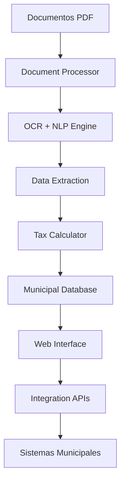

# 🏛️ Municipal AI System - Automatización Integral de Documentos Notariales

## 🎯 Propósito
Sistema integral de automatización para el procesamiento de documentos notariales (escrituras, herencias, compraventas) y cálculo automático de impuestos municipales usando IA/ML/DL.

**Cliente**: Ayuntamiento de Alfafar  
**Objetivo**: Eliminar procesamiento manual, reducir errores y acelerar trámites fiscales.

## 📚 Documentación

- **[📖 Guía de Desarrollo](docs/guia_desarrollo.md)**: Comandos esenciales, gestión de entornos virtuales y flujo de trabajo
- **[✅ Verificación del Sistema](docs/verificacion_guia.md)**: Estado actual y funcionalidades probadas
- **[📋 Contexto del Proyecto](docs/context/)**: Documentos completos de definición y especificación
- **[📊 Ejemplos de MCPs](docs/ejemplos_docs_municipales.md)**: Todos los ejemplos de escrituras en JSON
- **[🏗️ Arquitectura](docs/)**: Diseño del sistema y patrones implementados  
- **[🔧 Configuración](config/)**: Variables de entorno y esquemas de validación
- **[🧪 Testing](tests/)**: Tests unitarios y de integración

### 🚀 Inicio Rápido
```bash
# Configuración inicial
make setup

# Activar entorno virtual
source venv/bin/activate

# Ver estado completo del proyecto
make status

# Gestionar contexto del proyecto
make show-context                              # Ver contexto actual
cp /tus/documentos/*.txt docs/context/         # Subir documentos de contexto
make index-context                             # Indexar documentos

# Ver comandos disponibles  
make help

# Consultar guía completa
cat docs/guia_desarrollo.md
```

## 🏗️ Arquitectura del Sistema


## 🛠️ Stack Tecnológico

### **Microservicio 1: Document Processor**
- **OCR**: Tesseract + PyMuPDF
- **NLP**: spaCy + Custom NER Models
- **ML**: Fine-tuned BERT para clasificación
- **API**: FastAPI + Celery (async processing)

### **Microservicio 2: Tax Calculator**
- **Engine**: Rules-based + ML predictions
- **Database**: PostgreSQL + Redis cache
- **Regulations**: JSON schemas + Python validators

### **Interface Web**
- **Framework**: Django Admin + Custom Apps
- **Frontend**: Bootstrap + htmx
- **Reports**: WeasyPrint (PDF generation)

### **Infraestructura**
- **Containerization**: Docker + Kubernetes
- **Cloud**: Google Cloud Platform
- **CI/CD**: GitHub Actions
- **Monitoring**: Prometheus + Grafana

## 📄 Tipos de Documentos Procesados

### **Escrituras de Compraventa**
- 🏠 Datos del inmueble (dirección, referencia catastral)
- 💰 Precio de compraventa y valor catastral
- 👥 Comprador y vendedor (DNI, nombres)
- 📅 Fechas de operación y otorgamiento
- 📋 Cálculo: ITP, AJD, Plusvalía Municipal

### **Documentos de Herencia**
- 👨‍👩‍👧‍👦 Causante y herederos
- 🏠 Bienes inmuebles heredados
- 💰 Valoración de herencia
- 📋 Cálculo: Impuesto de Sucesiones

### **Documentos Privados**
- 📜 Contratos de arrendamiento
- 🤝 Acuerdos patrimoniales
- 📋 Cálculo: Transmisiones Patrimoniales

## 🚀 Features Principales

### **🤖 Procesamiento Inteligente**
- ✅ OCR automático de documentos escaneados
- ✅ Extracción de entidades con NLP custom
- ✅ Clasificación automática por tipo de documento
- ✅ Validación de datos extraídos

### **💰 Cálculo Automático de Impuestos**
- ✅ Motor de reglas basado en normativa municipal
- ✅ Integración con bases de datos catastrales
- ✅ Cálculo automático de bases imponibles
- ✅ Generación de liquidaciones

### **🌐 Integración Sistemas Municipales**
- ✅ API connector con Catastro
- ✅ Sincronización con sistema tributario
- ✅ Integración con Registro de la Propiedad
- ✅ Export a aplicaciones internas existentes

## 📁 Estructura del Proyecto
```
municipal-ai-system/
├── document-processor/    # Microservicio OCR/NLP
├── tax-calculator/        # Microservicio cálculos
├── web-interface/         # Django admin interface
├── database/             # Schemas y migrations
├── integration/          # APIs sistemas municipales
├── deployment/           # Docker + Kubernetes
└── docs/                # Documentación técnica
```

## 🏃‍♂️ Cómo Ejecutar (Desarrollo)

### Con Docker Compose
```bash
# Levantar todos los servicios
docker-compose up -d

# Servicios disponibles:
# - Document Processor: http://localhost:8001
# - Tax Calculator: http://localhost:8002  
# - Web Interface: http://localhost:8000
# - PostgreSQL: localhost:5432
```

### Desarrollo Individual
```bash
# Document Processor
cd document-processor
python -m venv venv && source venv/bin/activate
pip install -r requirements.txt
uvicorn src.main:app --port 8001 --reload

# Tax Calculator
cd tax-calculator
python -m venv venv && source venv/bin/activate
pip install -r requirements.txt
uvicorn src.main:app --port 8002 --reload

# Web Interface
cd web-interface
python -m venv venv && source venv/bin/activate
pip install -r requirements.txt
python manage.py runserver
```

## 📊 Métricas de Impacto Esperadas
- ⚡ **Reducción 90%** tiempo procesamiento documentos
- 🎯 **Precisión >95%** en extracción de datos
- 💰 **Ahorro 80%** costes administrativos
- 📈 **Incremento 300%** productividad funcionarios
- ❌ **Reducción 95%** errores humanos

## 📚 Roadmap de Desarrollo

### Fase 1: MVP Core (Meses 1-2)
- [ ] Document processor básico (OCR + NLP)
- [ ] Tax calculator para compraventas
- [ ] Interface web administrativa
- [ ] Base de datos y modelos

### Fase 2: IA Avanzada (Meses 3-4)  
- [ ] Fine-tuning modelos NLP específicos
- [ ] ML para predicción valores catastrales
- [ ] Validación automática documentos
- [ ] Reports automáticos

### Fase 3: Integración (Meses 5-6)
- [ ] APIs integración sistemas municipales
- [ ] Deployment producción
- [ ] Training funcionarios
- [ ] Monitoring y analytics

## 🔒 Consideraciones de Seguridad
- 🔐 Encriptación end-to-end documentos
- 🛡️ GDPR compliance (datos personales)
- 🔑 Autenticación robusta funcionarios
- 📝 Audit logs completos
- 🏛️ Cumplimiento normativa municipal

## 📞 Contacto
**Proyecto**: Sistema Automatización Municipal  
**Desarrollador**: Jose  
**Cliente**: Ayuntamiento de Alfafar  
**Estado**: En desarrollo (MVP) 