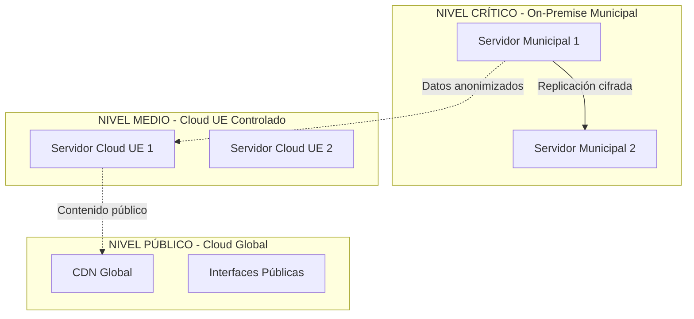

# Arquitectura Técnica Conforme a Normativa
## Sistema Municipal de IA - Ayuntamiento de Alfafar

---

## 📋 OBJETIVO DEL DOCUMENTO

Este documento establece la **arquitectura técnica específica** del Sistema Municipal de IA del Ayuntamiento de Alfafar, diseñada desde el primer boceto para cumplir integralmente con RGPD, AI Act, LOPDGDD y ENS, garantizando **Privacy by Design** y **Security by Default** para todo el régimen tributario municipal.

---

## 🏗️ DISEÑO ARQUITECTÓNICO GENERAL

### **Principio Fundamental: Segregación por Sensibilidad de Datos**

Considerando el contexto normativo actual (**referencia: 31 julio 2025**), el sistema se diseña con arquitectura híbrida que garantizará cumplimiento integral del AI Act y normativa vigente, sin plazos rígidos de implementación.



---

## 🔴 NIVEL CRÍTICO: DATOS SENSIBLES (On-Premise)

### **🎯 Datos que NUNCA pueden salir del ayuntamiento:**

#### **Tributarios específicos por figura:**
```yaml
# IIVTNU (Plusvalía - especialidad José):
datos_criticos:
  - dni_contribuyente: "Identificación completa"
  - escrituras_originales: "Documentos notariales completos"
  - valores_reales_transmision: "Importes exactos compraventa"
  - coeficientes_actualizacion: "Cálculos específicos municipales"
  - historico_transmisiones: "Cadena completa titularidades"

# IBI (Impuesto Bienes Inmuebles):
datos_criticos:
  - referencias_catastrales: "Identificación específica inmuebles"
  - valores_catastrales_reales: "Valoraciones oficiales"
  - titularidades_completas: "Propietarios con porcentajes"
  - direcciones_exactas: "Ubicaciones precisas"
  - superficie_construida_real: "Metros cuadrados exactos"

# IAE (Impuesto Actividades Económicas):
datos_criticos:
  - epigrafe_iae_especifico: "Clasificación actividad exacta"
  - ubicacion_actividad: "Dirección establecimiento"
  - fecha_inicio_actividad: "Momento exacto alta"
  - volumen_operaciones: "Facturación real declarada"
  - empleados_establecimiento: "Personal exacto"

# ICIO (Construcciones, Instalaciones, Obras):
datos_criticos:
  - proyectos_tecnicos_completos: "Planos, memorias, cálculos"
  - presupuestos_reales_obra: "Costes exactos construcción"
  - licencias_urbanisticas: "Permisos específicos concedidos"
  - estado_ejecucion_obra: "Porcentaje real completado"
  - arquitectos_tecnicos: "Profesionales responsables"

# IVTM (Vehículos Tracción Mecánica):
datos_criticos:
  - matriculas_completas: "Identificación vehículo"
  - potencia_fiscal_exacta: "CV para liquidación"
  - titular_vehiculo: "Propietario registral"
  - fecha_matriculacion: "Antigüedad exacta"
  - domicilio_tributario: "Dirección a efectos fiscales"
```

#### **Tasas municipales específicas:**
```yaml
# Tasa Vado Permanente:
datos_criticos:
  - ubicacion_exacta_vado: "Metros lineales ocupados"
  - titular_autorizacion: "Beneficiario específico"
  - fecha_concesion: "Momento inicio obligación"
  - tipo_vehiculo_autorizado: "Características específicas"

# Tasa Ocupación Vía Pública (Mesas/Sillas):
datos_criticos:
  - metros_cuadrados_ocupados: "Superficie exacta concedida"
  - establecimiento_beneficiario: "Identificación completa"
  - horarios_autorizados: "Franjas temporales exactas"
  - temporada_concesion: "Período específico autorizado"

# Tasa Cementerio Municipal:
datos_criticos:
  - ubicacion_sepultura: "Localización exacta"
  - titular_concesion: "Derechos funerarios"
  - fecha_inhumacion: "Momento ocupación"
  - periodo_concesion: "Duración derechos"

# Tasa Licencias Urbanísticas:
datos_criticos:
  - expediente_licencia: "Número identificativo único"
  - proyecto_completo: "Documentación técnica"
  - superficie_intervencion: "Metros afectados"
  - uso_urbanistico: "Destino específico autorizado"
```

### **🔒 Arquitectura de Seguridad Nivel Crítico:**

#### **Servidores físicos municipales:**
```yaml
# Configuración Hardware:
servidor_municipal_1:
  ubicacion: "Ayuntamiento Alfafar - Planta sótano"
  especificaciones:
    cpu: "Intel Xeon Gold 6248R (24 cores)"
    ram: "128GB DDR4 ECC"
    storage: "4TB NVMe SSD RAID 1 + 8TB HDD RAID 5"
    red: "Dual 10GbE + fibra municipal"
  cifrado:
    disco: "LUKS2 con AES-256-XTS"
    certificacion: "FIPS 140-2 Level 2"
    hsm: "Hardware Security Module integrado"

servidor_municipal_2:
  ubicacion: "Ayuntamiento Alfafar - Sala servidores"
  funcion: "Backup en tiempo real + alta disponibilidad"
  sincronizacion: "Replicación continua cifrada"
  activacion: "Automática en caso fallo servidor 1"
```

#### **Red municipal segura:**
```yaml
# Topología de red:
red_municipal:
  segmentacion:
    vlan_tributaria: "Aislada físicamente"
    vlan_funcionarios: "Acceso controlado por roles"
    vlan_ciudadanos: "Solo servicios públicos"
  firewall:
    tipo: "Fortinet FortiGate 600E"
    reglas: "Whitelist estricta por servicio"
    monitoreo: "IDS/IPS en tiempo real"
  vpn:
    acceso_remoto: "Solo funcionarios autorizados"
    autenticacion: "Certificados X.509 + 2FA"
    cifrado: "IPSec con AES-256"
```

---

## 🟡 NIVEL MEDIO: PROCESAMIENTO CONTROLADO (Cloud UE)

### **🎯 Datos que SÍ pueden procesarse en cloud europeo (anonimizados):**

#### **Para OCR y procesamiento documental:**
```yaml
# Documentos anonimizados para IA:
documentos_nivel_medio:
  # IIVTNU:
  - escrituras_sin_identificadores: "Texto OCR sin DNI/nombres"
  - patrones_valoracion: "Tendencias mercado inmobiliario"
  - coeficientes_historicos: "Series temporales valores"
  
  # IBI:
  - valoraciones_anonimas: "Estadísticas catastrales agregadas"
  - superficies_tipo: "Patrones construcción barrio"
  - indices_mercado: "Evolución precios por zonas"
  
  # IAE:
  - actividades_anonimas: "Estadísticas epígrafes"
  - localizaciones_agregadas: "Densidad actividades zona"
  - evolucion_sectorial: "Tendencias actividad económica"
  
  # Tasas:
  - ocupaciones_anonimas: "Patrones uso vía pública"
  - demanda_servicios: "Estadísticas uso municipal"
  - estacionalidad: "Picos demanda por época"
```

#### **Proveedores cloud conformes (agosto 2025):**
```yaml
# Proveedores certificados UE:
proveedores_permitidos:
  principal: 
    nombre: "OVH Cloud (Francia)"
    certificaciones: ["ISO 27001", "SOC 2", "RGPD nativo"]
    ubicacion: "Datacenter Roubaix, Francia"
    latencia: "< 15ms desde Valencia"
    
  secundario:
    nombre: "Hetzner Cloud (Alemania)"
    certificaciones: ["ISO 27001", "GDPR compliant"]
    ubicacion: "Datacenter Falkenstein, Alemania"
    funcion: "Backup geográfico + procesamiento adicional"
    
  terciario:
    nombre: "Arsys Cloud (España)"
    certificaciones: ["ENS Medio", "ISO 27001"]
    ubicacion: "Madrid, España"
    funcion: "Procesamiento nacional prioritario"
```

#### **Servicios específicos en cloud UE:**
```yaml
# Microservicios distribuidos:
document_processor_cloud:
  replicas: 3
  funcion: "OCR masivo documentos anonimizados"
  modelo_ia: "Tesseract + Custom ML modelo español"
  throughput: "500 documentos/hora pico demanda"
  
tax_calculator_cloud:
  replicas: 2  
  funcion: "Cálculos tributarios validación cruzada"
  algoritmos: "Validación contra bases históricas"
  precision: "> 99.95% exactitud matemática"
  
anomaly_detector:
  replicas: 2
  funcion: "Detección patrones irregulares tributarios"
  modelo_ia: "ML supervisado + reglas expertas"
  alertas: "Funcionario obligatoria si confianza < 85%"
```

---

## 🟢 NIVEL PÚBLICO: SERVICIOS CIUDADANOS (Cloud Global)

### **🎯 Servicios públicos sin datos sensibles:**

#### **Portal ciudadano público:**
```yaml
# Servicios públicos generales:
web_interface_publica:
  contenido:
    - informacion_general_tributos: "Qué impuestos existen"
    - calculadora_estimativa: "Estimaciones sin datos reales"
    - formularios_publicos: "Descarga impresos"
    - calendario_fiscal: "Fechas importantes"
    - transparencia_ia: "Información algoritmos usados"
    - portal_dpd: "Ejercicio derechos ciudadanos"
  
  tecnologia:
    cdn: "CloudFlare (global)"
    hosting: "Vercel (edge computing)"
    certificados: "Let's Encrypt + certificados municipales"
    rendimiento: "< 2 segundos carga global"
```

#### **APIs públicas municipales:**
```yaml
# Interfaces públicas conformes:
api_publica_municipal:
  endpoints_permitidos:
    - "/tributos/info-general": "Información no sensible"
    - "/tramites/formularios": "Descargas públicas"
    - "/transparencia/algoritmos": "Info sistemas IA"
    - "/dpd/ejercicio-derechos": "Portal DPO"
    - "/estadisticas/agregadas": "Datos municipales agregados"
  
  restricciones:
    rate_limiting: "100 requests/minuto/IP"
    autenticacion: "No requerida (datos públicos)"
    logs: "Anonimizados (solo estadísticas uso)"
```

---

## 🔄 INTERCONEXIÓN SEGURA ENTRE NIVELES

### **🌉 Flujos de datos autorizados:**

#### **Nivel Crítico → Nivel Medio (unidireccional):**
```yaml
# Proceso anonimización automática:
flujo_critico_medio:
  frecuencia: "Diario a las 02:00h"
  proceso:
    1: "Extracción datos municipales"
    2: "Anonimización irreversible (SHA-256)"
    3: "Agregación estadística"
    4: "Transferencia cifrada a cloud UE"
    5: "Verificación integridad"
    6: "Eliminación datos temporales"
  
  ejemplo_anonimizacion:
    entrada: "DNI 12345678A, IIVTNU 1.200€, Calle Mayor 15"
    salida: "Hash_AB23C, valor_rango_1000-1500, zona_centro"
    
  log_auditoria:
    que_se_transfiere: "Siempre registrado"
    cuando: "Timestamp exacto"
    hash_verificacion: "Integridad garantizada"
    responsable: "DPO + funcionario técnico"
```

#### **Nivel Medio → Nivel Crítico (resultados procesamiento):**
```yaml
# Retorno resultados IA:
flujo_medio_critico:
  contenido_permitido:
    - alertas_anomalias: "Patrones irregulares detectados"
    - validaciones_cruzadas: "Verificaciones automáticas"
    - estadisticas_agregadas: "Tendencias municipales"
    - metricas_rendimiento: "Precisión algoritmos"
  
  contenido_prohibido:
    - datos_individuales: "Nunca retornan datos específicos"
    - identificadores: "Hashes reversibles prohibidos"
    - geolocalizaciones_exactas: "Solo agregaciones zona"
```

---

## 🐳 IMPLEMENTACIÓN DOCKER SWARM CONFORME

### **Configuración específica por nivel de datos:**

#### **Docker Swarm On-Premise (Datos Críticos):**
```yaml
# docker-compose-critico.yml
version: '3.8'
services:
  postgres_tributario:
    image: postgres:15-alpine
    deploy:
      placement:
        constraints: 
          - node.labels.security == high
          - node.labels.location == municipal
      replicas: 1
      restart_policy:
        condition: on-failure
        max_attempts: 3
    environment:
      - POSTGRES_DB=tributario_alfafar
      - POSTGRES_USER_FILE=/run/secrets/postgres_user
      - POSTGRES_PASSWORD_FILE=/run/secrets/postgres_password
    volumes:
      - postgres_data:/var/lib/postgresql/data
      - postgres_backup:/backup
    secrets:
      - postgres_user
      - postgres_password
    networks:
      - red_tributaria_interna

  redis_sesiones:
    image: redis:7-alpine
    deploy:
      placement:
        constraints: 
          - node.labels.security == high
      replicas: 1
    command: redis-server --requirepass-file /run/secrets/redis_password
    secrets:
      - redis_password
    volumes:
      - redis_data:/data
    networks:
      - red_tributaria_interna

  integration_layer_local:
    image: alfafar/integration:secure
    deploy:
      placement:
        constraints: 
          - node.labels.security == high
      replicas: 2
    environment:
      - RGPD_MODE=strict
      - AUDIT_LEVEL=complete
      - DATA_RETENTION_DAYS=1460  # 4 años tributarios
    secrets:
      - api_keys
      - audit_keys
    networks:
      - red_tributaria_interna
      - red_publica_segura

networks:
  red_tributaria_interna:
    driver: overlay
    encrypted: true
    external: false
  red_publica_segura:
    driver: overlay
    encrypted: true

secrets:
  postgres_user:
    external: true
  postgres_password:
    external: true
  redis_password:
    external: true
  api_keys:
    external: true
  audit_keys:
    external: true

volumes:
  postgres_data:
    driver: local
    driver_opts:
      type: ext4
      device: /dev/mapper/datos_criticos
  postgres_backup:
    driver: local
    driver_opts:
      type: ext4  
      device: /dev/mapper/backup_criticos
  redis_data:
    driver: local
    driver_opts:
      type: ext4
      device: /dev/mapper/cache_seguro
```

#### **Docker Swarm Cloud UE (Procesamiento Medio):**
```yaml
# docker-compose-cloud-ue.yml
version: '3.8'
services:
  document_processor_ai:
    image: alfafar/document-processor:ai-enabled
    deploy:
      placement:
        constraints:
          - node.labels.cloud == eu-compliant
          - node.labels.gdpr == native
      replicas: 3
      update_config:
        parallelism: 1
        delay: 30s
        failure_action: rollback
    environment:
      - AI_MODEL_VERSION=2.1.0
      - PROCESSING_MODE=anonymous
      - DATA_RETENTION_HOURS=24
      - CLOUD_REGION=eu-west-1
    networks:
      - red_procesamiento_eu

  tax_calculator_validator:
    image: alfafar/tax-calculator:cloud
    deploy:
      placement:
        constraints:
          - node.labels.cloud == eu-compliant
      replicas: 2
    environment:
      - CALCULATION_MODE=validation
      - PRECISION_THRESHOLD=99.95
      - ANOMALY_DETECTION=enabled
    networks:
      - red_procesamiento_eu

  anomaly_detector_ml:
    image: alfafar/anomaly-detector:ml
    deploy:
      placement:
        constraints:
          - node.labels.cloud == eu-compliant
          - node.labels.ai == approved
      replicas: 2
    environment:
      - ML_MODEL=supervised_municipal
      - CONFIDENCE_THRESHOLD=85
      - ALERT_LEVEL=human_review_required
    networks:
      - red_procesamiento_eu

networks:
  red_procesamiento_eu:
    driver: overlay
    encrypted: true
```

---

## 📊 MONITORIZACIÓN Y AUDITORÍA CONTINUA

### **Sistema de logs estructurados conformes:**

#### **Logs tributarios específicos:**
```json
{
  "timestamp": "2025-07-31T08:25:00Z",
  "sistema": "iivtnu_calculator",
  "accion": "calculo_plusvalia",
  "usuario_hash": "sha256_funcionario_001",
  "expediente_hash": "sha256_exp_2025_1547",
  "input": {
    "tipo_calculo": "incremento_valor",
    "anos_tenencia": 8,
    "valor_catastral_hash": "sha256_valor_original"
  },
  "output": {
    "resultado_euros": 2150,
    "coeficiente_aplicado": 1.15,
    "revision_humana_requerida": false,
    "confianza_algoritmo": 0.96
  },
  "cumplimiento": {
    "base_legal": "LRHL_art_104",
    "ordenanza_municipal": "alfafar_iivtnu_2025",
    "supervision_humana": "realizada",
    "trazabilidad_completa": true
  },
  "auditoria": {
    "nodo_procesamiento": "servidor_municipal_1",
    "tiempo_procesamiento_ms": 245,
    "datos_anonimizados": true,
    "cumplimiento_rgpd": true
  }
}
```

#### **Dashboard de cumplimiento normativo:**
```yaml
# Métricas tiempo real:
dashboard_cumplimiento:
  metricas_rgpd:
    - tiempo_respuesta_derechos: "< 30 días (actual: 12 días)"
    - solicitudes_rectificacion: "15 completadas julio 2025"
    - solicitudes_portabilidad: "3 completadas julio 2025"
    - incidentes_privacidad: "0 julio 2025"
  
  metricas_ai_act:
    - decisiones_supervision_humana: "100% sanciones >300€"
    - precision_ocr_documentos: "99.7% julio 2025"
    - alertas_sesgo_algoritmo: "0 detectadas julio 2025"
    - auditorias_ia_realizadas: "1 trimestre Q3 2025"
  
  metricas_tecnicas:
    - disponibilidad_sistema: "99.8% julio 2025"
    - tiempo_respuesta_medio: "1.2 segundos"
    - backups_exitosos: "100% últimos 30 días"
    - tests_penetracion: "Último: 15 julio 2025 - APTO"
```

---

## 🔐 SEGURIDAD POR CAPAS (DEFENSE IN DEPTH)

### **Nivel 1: Perímetro físico municipal**
```yaml
seguridad_fisica:
  acceso_datacenter:
    autenticacion: "Tarjeta RFID + biometría"
    autorizados: ["DPO", "Técnico TI", "Secretario Municipal"]
    registro: "Log completo accesos con cámaras"
    backup_energia: "SAI 30 minutos + generador automático"
  
  proteccion_hardware:
    chasis_servidores: "Cerraduras físicas con alarma"
    discos_duros: "Auto-cifrado hardware AES-256"
    ram: "Borrado automático tras apagado"
    conexiones: "Cables blindados categoría 6A"
```

### **Nivel 2: Red y comunicaciones**
```yaml
seguridad_red:
  firewall_perimetral:
    reglas: "Default DENY + whitelist específica"
    monitorizacion: "IDS/IPS Suricata tiempo real"
    geo_blocking: "Solo tráfico España + UE autorizada"
    
  segmentacion_interna:
    vlan_tributaria: "Aislada físicamente red general"
    vlan_ai_processing: "Solo servicios IA autorizados"
    vlan_backup: "Red dedicada sincronización"
    vlan_management: "Solo administración sistema"
```

### **Nivel 3: Aplicación y datos**
```yaml
seguridad_aplicacion:
  autenticacion:
    funcionarios: "AD municipal + 2FA obligatorio"
    ciudadanos: "Cl@ve + certificado digital"
    sistemas: "mTLS certificados X.509"
  
  autorizacion:
    rbac: "Roles granulares por función municipal"
    abac: "Políticas contextuales (horario, ubicación)"
    audit: "Log completo acciones por usuario"
  
  cifrado_datos:
    reposo: "AES-256 con claves HSM"
    transito: "TLS 1.3 + Perfect Forward Secrecy"
    backup: "Cifrado independiente con rotación claves"
```

---

## 📋 CONSIDERACIONES DE IMPLEMENTACIÓN

### **Enfoque Modular Flexible**

La implementación seguirá un **enfoque progresivo** sin plazos rígidos, adaptándose a los recursos y tiempo disponibles del ayuntamiento:

#### **Módulo 1: Fundamentos de Seguridad**
```yaml
infraestructura_base:
  - instalacion_servidores_municipales
  - configuracion_red_segura_basica  
  - implementacion_cifrado_discos
  - despliegue_postgres_local_cifrado
  - configuracion_backup_automatico
  - instalacion_docker_swarm_local
  - configuracion_secrets_management
  - testing_seguridad_perimetral
  - configuracion_logs_auditoria
```

#### **Módulo 2: Integración Cloud UE**
```yaml
expansion_capacidades:
  - contratacion_proveedores_cloud_ue_conformes
  - configuracion_vpn_municipal_cloud
  - desarrollo_apis_anonimizacion
  - despliegue_document_processor_cloud
  - implementacion_tax_calculator_cloud
  - desarrollo_anomaly_detector_ml
  - integracion_sistemas_local_cloud
  - testing_rendimiento_integral
```

#### **Módulo 3: Servicios Ciudadanos**
```yaml
operacion_completa:
  - migracion_datos_historicos_segura
  - activacion_servicios_ciudadanos  
  - formacion_funcionarios_sistema
  - activacion_progresiva_tributos
  - monitoring_rendimiento_continuo
  - optimizacion_basada_metricas
  - ajustes_algoritmos_ia_municipales
  - auditoria_cumplimiento_periodica
```

---

## ✅ CERTIFICACIONES Y CUMPLIMIENTO

### **Certificaciones objetivo:**
```yaml
certificaciones_planificadas:
  iso_27001:
    auditor_sugerido: "AENOR"
    alcance: "Sistema municipal IA completo"
    requisitos: "Gestión seguridad información"
    
  ens_medio:
    auditor: "CCN-CERT"
    nivel: "Medio (datos tributarios municipales)"
    requisitos: "Esquema Nacional Seguridad"
    
  rgpd_compliance:
    auditor_sugerido: "Consultoría especializada DPO"
    alcance: "Tratamiento datos tributarios + IA"
    requisitos: "Protección datos personales"
    
  ai_act_conformity:
    organismo: "Autoridad competente española IA"
    sistemas: "Todos los algoritmos municipales"
    requisitos: "Sistemas IA alto riesgo AAPP"
```

---

**📅 Documento actualizado**: 31 julio 2025  
**🔄 Próxima revisión**: Según evolución proyecto  
**📧 Responsable**: DPO + Jefe Sistemas Municipales  
**🎯 Versión**: 1.0 - Arquitectura técnica conforme