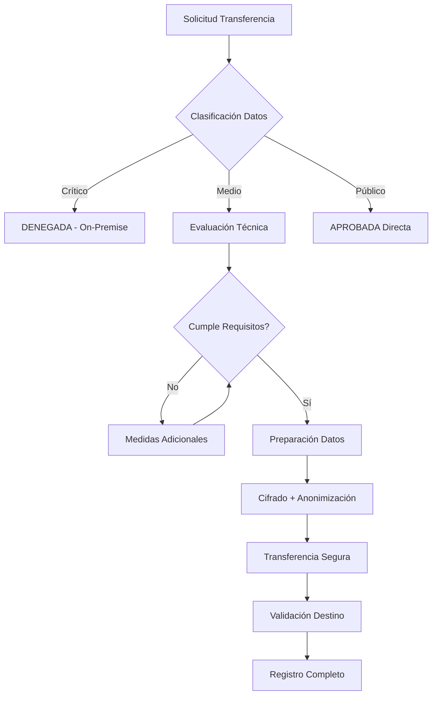

# 07. TRANSFERENCIAS INTERNACIONALES DE DATOS
## Sistema Municipal IA - Ayuntamiento de Alfafar

---

**📅 Documento:** 07_Transferencias_Internacionales.md  
**🏛️ Entidad:** Ayuntamiento de Alfafar (Valencia, España)  
**⚖️ Marco normativo:** RGPD Art. 44-49, LOPDGDD, AI Act UE  
**📋 Versión:** 1.0  
**📅 Fecha:** 1 agosto 2025  
**👤 Responsable:** José - Inspección Tributaria  

---

## 🎯 OBJETIVO DEL DOCUMENTO

Establecer el marco legal y técnico específico para las **transferencias internacionales de datos** del Sistema Municipal IA hacia proveedores cloud ubicados en la Unión Europea, garantizando pleno cumplimiento del RGPD y protección máxima de datos tributarios ciudadanos.

---

## 📋 ÍNDICE

1. [Marco Normativo Aplicable](#marco-normativo-aplicable)
2. [Arquitectura de Transferencias](#arquitectura-de-transferencias)
3. [Datos Transferibles por Nivel](#datos-transferibles-por-nivel)
4. [Garantías y Salvaguardas](#garantías-y-salvaguardas)
5. [Contratos y Acuerdos DPA](#contratos-y-acuerdos-dpa)
6. [Medidas Técnicas Específicas](#medidas-técnicas-específicas)
7. [Evaluación de Riesgos](#evaluación-de-riesgos)
8. [Procedimientos Operativos](#procedimientos-operativos)
9. [Monitoreo y Auditoría](#monitoreo-y-auditoría)
10. [Casos de Emergencia](#casos-de-emergencia)

---

## 📚 1. MARCO NORMATIVO APLICABLE

### 1.1 Normativa Principal

#### **RGPD - Capítulo V (Art. 44-49)**
- **Art. 44**: Principio general transferencias
- **Art. 45**: Decisiones de adecuación (UE como destino seguro)
- **Art. 46**: Transferencias con garantías adecuadas
- **Art. 47**: Normas corporativas vinculantes
- **Art. 48**: Transferencias no autorizadas por Derecho UE
- **Art. 49**: Excepciones para situaciones específicas

#### **LOPDGDD**
- **Art. 40**: Transferencias internacionales en sector público
- **Art. 41**: Garantías específicas administraciones públicas

#### **AI Act UE**
- **Art. 25**: Transferencias sistemas IA alto riesgo
- **Requisitos específicos**: Documentación, transparencia, control humano

### 1.2 Guías Interpretativas

#### **Comité Europeo Protección Datos (CEPD)**
- Guías sobre transferencias post-Schrems II
- Recomendaciones medidas suplementarias
- Criterios evaluación países terceros

#### **AEPD (España)**
- Guía transferencias internacionales (actualizada 2024)
- Criterios específicos sector público
- Templates DPA administraciones locales

---

## 🏗️ 2. ARQUITECTURA DE TRANSFERENCIAS

### 2.1 Estrategia Híbrida Municipal

```
┌─────────────────────────────────────────────────────────────┐
│                    ARQUITECTURA HÍBRIDA                     │
├─────────────────────────────────────────────────────────────┤
│  🔴 NIVEL CRÍTICO (ON-PREMISE)                             │
│  ├── DNI/NIF originales                                    │
│  ├── Escrituras notariales completas                       │
│  ├── Valores económicos reales                             │
│  ├── Referencias catastrales                               │
│  └── Expedientes completos                                 │
│                                                             │
│  🟡 NIVEL MEDIO (CLOUD UE)                                 │
│  ├── Datos anonimizados para entrenamiento IA             │
│  ├── Metadatos estructurados                               │
│  ├── Resultados OCR post-procesados                        │
│  ├── Modelos ML entrenados                                 │
│  └── Analytics agregados                                   │
│                                                             │
│  🟢 NIVEL PÚBLICO (CLOUD GLOBAL)                           │
│  ├── Interfaces ciudadanos                                 │
│  ├── Formularios públicos                                  │
│  ├── Información general municipio                         │
│  └── APIs públicas sin datos sensibles                     │
└─────────────────────────────────────────────────────────────┘
```

### 2.2 Destinos Autorizados

#### **Únicamente Unión Europea**
- **Proveedores certificados**: AWS Europa, Google Cloud Europa, Microsoft Azure Europa
- **Ubicación física**: Centros datos en territorio UE
- **Jurisdicción**: Derecho europeo aplicable
- **Supervisión**: Autoridades protección datos UE

#### **Prohibiciones Absolutas**
- ❌ **Estados Unidos** (post-Schrems II)
- ❌ **Países sin decisión adecuación**
- ❌ **Proveedores con matrices fuera UE**
- ❌ **Servicios con acceso gobierno extranjero**

---

## 📊 3. DATOS TRANSFERIBLES POR NIVEL

### 3.1 Nivel Crítico - Prohibido Transferir

| **Tipo de Dato** | **Descripción** | **Base Legal Prohibición** |
|-------------------|-----------------|----------------------------|
| **Identificadores personales** | DNI, NIF, nombres completos | Art. 6 RGPD + LOPDGDD |
| **Datos económicos reales** | Valores compraventa, herencias | Secreto tributario |
| **Documentos notariales** | Escrituras originales completas | Art. 9 RGPD (datos sensibles) |
| **Referencias catastrales** | Códigos identificación inmuebles | LRHL + normativa catastral |
| **Expedientes administrativos** | Procedimientos sancionadores | Art. 24 LOPDGDD |

### 3.2 Nivel Medio - Transferible con Garantías

| **Tipo de Dato** | **Condiciones Transferencia** | **Medidas Técnicas** |
|-------------------|-------------------------------|----------------------|
| **Texto anonimizado** | Eliminación completa identificadores | Cifrado AES-256 extremo a extremo |
| **Metadatos estructurados** | Sin referencias personales | Seudonimización irreversible |
| **Resultados OCR** | Post-procesado limpieza datos | Hashing campos sensibles |
| **Modelos entrenados** | Sin datos entrenamiento incluidos | Validación ausencia memorización |
| **Analytics agregados** | k-anonimato mínimo 5 registros | Auditoría estadística previa |

### 3.3 Nivel Público - Transferible Libremente

| **Tipo de Dato** | **Justificación** | **Ejemplos** |
|-------------------|-------------------|--------------|
| **Información municipal** | Transparencia administrativa | Ordenanzas, horarios, contactos |
| **Formularios vacíos** | Servicio ciudadano | Templates sin completar |
| **Datos estadísticos** | Interés público | Agregados poblacionales >1000 hab |
| **APIs públicas** | Eficiencia administrativa | Consultas generales sin autenticación |

---

## 🛡️ 4. GARANTÍAS Y SALVAGUARDAS

### 4.1 Garantías Jurídicas

#### **Cláusulas Contractuales Tipo (CCT)**
```
Contrato DPA Municipal debe incluir:
├── CCT 2021/914 (versión actualizada)
├── Cláusulas específicas sector público
├── Jurisdicción española/europea
├── Auditorías sin previo aviso
├── Derecho suspensión inmediata
├── Eliminación garantizada datos
├── Notificación incidentes <24h
└── Seguro responsabilidad civil (min. 2M€)
```

#### **Evaluación de Impacto Específica**
- **EIPD transferencias**: Análisis riesgos específicos cloud
- **Medidas suplementarias**: Cifrado adicional, controles acceso
- **Revisión periódica**: Cada 12 meses o cambio normativo
- **Validación DPD**: Informe favorable obligatorio

### 4.2 Garantías Técnicas

#### **Cifrado Extremo a Extremo**
```
Datos en tránsito:
├── TLS 1.3 mínimo
├── Perfect Forward Secrecy
├── Certificados ECC P-384
└── HSTS obligatorio

Datos en reposo:
├── AES-256-GCM
├── Claves rotación automática
├── HSM gestión claves
└── Cifrado nivel columna BD
```

#### **Controles de Acceso**
- **Zero Trust**: Verificación continua identidad
- **MFA obligatorio**: Autenticación multifactor
- **Segregación redes**: VPNs dedicadas municipales
- **Logs inmutables**: Registro actividades completo

---

## 📄 5. CONTRATOS Y ACUERDOS DPA

### 5.1 Template DPA Municipal

#### **Estructura Obligatoria**
```
DPA Ayuntamiento Alfafar
├── 1. Definiciones y conceptos
├── 2. Objeto y duración tratamiento
├── 3. Obligaciones responsable (Ayuntamiento)
├── 4. Obligaciones encargado (proveedor cloud)
├── 5. Medidas técnicas y organizativas
├── 6. Transferencias internacionales
├── 7. Subcontratación (prohibida salvo autorización)
├── 8. Asistencia al responsable
├── 9. Auditorías y inspecciones
├── 10. Gestión incidencias y brechas
├── 11. Eliminación/devolución datos
├── 12. Responsabilidad y seguros
└── 13. Ley aplicable y jurisdicción
```

#### **Cláusulas Críticas Específicas**

**Cláusula de Localización Datos:**
> "El Encargado garantiza que todos los datos personales del Ayuntamiento de Alfafar se procesarán y almacenarán exclusivamente en centros de datos ubicados dentro del territorio de la Unión Europea. Queda expresamente prohibido cualquier acceso, procesamiento o transferencia a países terceros, incluso temporal."

**Cláusula de Transparencia Gubernamental:**
> "El Encargado notificará inmediatamente al Ayuntamiento cualquier solicitud de acceso a datos por parte de autoridades gubernamentales no europeas, comprometiéndose a impugnar legalmente dichas solicitudes hasta agotamiento de recursos jurídicos disponibles."

**Cláusula de Auditoría Municipal:**
> "El Ayuntamiento podrá realizar auditorías técnicas y legales sin previo aviso, con acceso completo a sistemas, logs, contratos subencargados y medidas implementadas. Los costes de auditoría serán asumidos por el Encargado en caso de incumplimientos detectados."

### 5.2 Proceso de Negociación

#### **Fase 1: Análisis Proveedor (30 días)**
- Certificaciones ISO 27001, SOC 2 Type II
- Historial incidentes seguridad (últimos 5 años)
- Políticas transferencias internacionales
- Referencias sector público similar

#### **Fase 2: Due Diligence Legal (45 días)**
- Revisión estatutos corporativos
- Análisis jurisdicciones aplicables
- Verificación independencia matrices no-UE
- Validación seguros responsabilidad civil

#### **Fase 3: Negociación Contractual (60 días)**
- Adaptación CCT a especificidades municipales
- Inclusión cláusulas técnicas específicas
- Definición SLAs y penalizaciones
- Establecimiento garantías bancarias

#### **Fase 4: Implementación Controlada (90 días)**
- Despliegue entorno pruebas
- Validación medidas técnicas
- Auditoría previa a producción
- Formación equipos municipales

---

## 🔧 6. MEDIDAS TÉCNICAS ESPECÍFICAS

### 6.1 Cifrado y Protección Datos

#### **Implementación por Capas**
```
Capa 1 - Aplicación:
├── Cifrado campo nivel (AES-256)
├── Tokenización datos sensibles
├── Hashing irreversible identificadores
└── Ofuscación dinâmica consultas

Capa 2 - Base Datos:
├── TDE (Transparent Data Encryption)
├── Cifrado backup completo
├── Claves rotación automática
└── HSM integrado gestión claves

Capa 3 - Sistema Operativo:
├── Cifrado disco completo (LUKS)
├── Particiones separadas datos
├── Firmas digitales binarios
└── Kernel hardening completo

Capa 4 - Red:
├── VPN sitio-a-sitio dedicada
├── Túneles IPSec redundantes
├── Filtros DPI anti-exfiltración
└── Monitoreo tráfico 24/7
```

#### **Gestión Claves Criptográficas**
- **HSM dedicado**: Módulo hardware exclusivo municipal
- **Escrow claves**: Custodia notarial para recuperación emergencia
- **Rotación automática**: Cada 90 días o evento sospechoso
- **Auditoría criptográfica**: Validación fortaleza algoritmos

### 6.2 Controles de Acceso

#### **Modelo Zero Trust Municipal**
```
Verificación Continua:
├── Autenticación multifactor (MFA)
├── Certificados cliente personalizados
├── Geolocalización restringida (España)
├── Horarios acceso limitados (8h-20h)
├── Dispositivos autorizados únicamente
├── Análisis comportamental continuo
└── Re-autenticación cada 4 horas
```

#### **Segregación por Roles**
| **Rol Municipal** | **Acceso Cloud** | **Datos Permitidos** | **Controles Adicionales** |
|-------------------|------------------|---------------------|---------------------------|
| **Inspector Tributario** | Solo lectura | Metadatos anonimizados | IP municipal únicamente |
| **Técnico Informático** | Administración | Logs y configuraciones | Doble aprobación cambios |
| **DPD Municipal** | Auditoría completa | Todos excepto datos personales | Registro detallado actividad |
| **Alcaldía** | Dashboard ejecutivo | KPIs agregados únicamente | Solo visualización |

### 6.3 Monitoreo y Detección

#### **SIEM Municipal Específico**
```
Alertas Tiempo Real:
├── Acceso fuera horario laboral
├── Descarga volúmenes inusuales
├── Intentos acceso no autorizados
├── Cambios configuración críticos
├── Transferencias no programadas
├── Anomalías patrones uso
└── Fallos autenticación múltiples
```

#### **Métricas de Seguridad**
- **RPO (Recovery Point Objective)**: <1 hora
- **RTO (Recovery Time Objective)**: <4 horas
- **Disponibilidad**: 99.9% (excl. mantenimientos)
- **Tiempo respuesta incidentes**: <30 minutos
- **Auditorías automáticas**: Diarias
- **Informes ejecutivos**: Semanales

---

## ⚠️ 7. EVALUACIÓN DE RIESGOS

### 7.1 Matriz de Riesgos Específicos

| **Riesgo** | **Probabilidad** | **Impacto** | **Nivel** | **Medidas Mitigación** |
|------------|------------------|-------------|-----------|------------------------|
| **Acceso gobierno no-UE** | Baja | Crítico | Alto | VPN UE, cifrado E2E, cláusulas contractuales |
| **Brecha seguridad proveedor** | Media | Alto | Alto | Monitoreo 24/7, alertas automáticas, DPA robusto |
| **Cambio normativo RGPD** | Media | Medio | Medio | Revisión trimestral, flexibilidad contractual |
| **Fallo técnico cifrado** | Baja | Crítico | Medio | HSM redundante, auditorías criptográficas |
| **Incumplimiento proveedor** | Baja | Alto | Medio | Auditorías sin previo aviso, penalizaciones |
| **Pérdida datos tránsito** | Muy Baja | Alto | Bajo | Redundancia canales, verificación integridad |

### 7.2 Escenarios de Emergencia

#### **Escenario 1: Solicitud Acceso Gobierno No-UE**
```
Protocolo Respuesta Inmediata:
├── Hora 0: Notificación proveedor a Ayuntamiento
├── Hora 1: Activación equipo crisis municipal
├── Hora 2: Contacto asesoría jurídica especializada
├── Hora 4: Decisión suspensión servicios si procede
├── Hora 8: Comunicación AEPD si activación
├── Día 1: Evaluación alternativas técnicas
└── Día 3: Informe completo y plan acción
```

#### **Escenario 2: Brecha Seguridad Confirmada**
```
Protocolo Gestión Crisis:
├── Inmediato: Aislamiento sistemas afectados
├── <1h: Evaluación alcance brecha
├── <4h: Notificación AEPD si procede
├── <24h: Comunicación ciudadanos afectados
├── <72h: Informe completo autoridades
├── <7 días: Plan remediación implementado
└── <30 días: Auditoría post-incidente
```

#### **Escenario 3: Cambio Normativo Crítico**
```
Protocolo Adaptación Normativa:
├── Día 0: Identificación cambio normativo
├── Día 7: Análisis impacto sistemas municipales
├── Día 15: Plan adaptación técnica/legal
├── Día 30: Renegociación contratos si necesario
├── Día 60: Implementación cambios técnicos
├── Día 90: Validación cumplimiento
└── Día 120: Auditoría conformidad completa
```

---

## 📋 8. PROCEDIMIENTOS OPERATIVOS

### 8.1 Proceso de Transferencia

#### **Workflow Autorización Transferencia**


#### **Checklist Pre-Transferencia**
- [ ] **Clasificación datos**: Confirmada como nivel medio/público
- [ ] **Anonimización**: Verificada ausencia identificadores
- [ ] **Cifrado**: AES-256 aplicado correctamente
- [ ] **Contrato DPA**: Vigente y actualizado
- [ ] **Destino UE**: Confirmada ubicación centros datos
- [ ] **Backup local**: Copia seguridad pre-transferencia
- [ ] **Registro actividad**: Log completo preparado
- [ ] **Aprobación DPD**: Validación formal obtenida

### 8.2 Monitoreo Continuo

#### **Dashboard Municipal en Tiempo Real**
```
Métricas Clave Visualizadas:
├── Volumen datos transferidos (24h/7d/30d)
├── Tipos datos por categoría (crítico/medio/público)
├── Estado conexiones VPN (activas/latencia)
├── Alertas seguridad (activas/resueltas/pendientes)
├── Cumplimiento SLA proveedor (%)
├── Auditorías programadas (próximas/completadas)
├── Incidentes reportados (gravedad/estado)
└── Certificaciones vigentes (validez/renovación)
```

#### **Informes Automáticos**
- **Diario**: Actividad transferencias y alertas
- **Semanal**: Cumplimiento SLA y métricas operativas
- **Mensual**: Análisis tendencias y optimizaciones
- **Trimestral**: Evaluación cumplimiento normativo
- **Anual**: Auditoría completa y renovación contratos

### 8.3 Gestión Incidencias

#### **Clasificación por Gravedad**
| **Nivel** | **Descripción** | **Tiempo Respuesta** | **Escalado** |
|-----------|-----------------|---------------------|--------------|
| **Crítico** | Brecha confirmada, acceso no autorizado | <15 minutos | Inmediato a Alcaldía + AEPD |
| **Alto** | Fallo cifrado, pérdida conectividad | <30 minutos | DPD + Técnico Jefe |
| **Medio** | Degradación rendimiento, alertas automáticas | <2 horas | Técnico responsable |
| **Bajo** | Anomalías menores, mantenimiento | <8 horas | Próxima revisión programada |

#### **Procedimiento Escalado Crisis**
```
Escalado Automático:
├── Nivel 1: Técnico guardia (0-30 min)
├── Nivel 2: DPD Municipal (30-60 min)  
├── Nivel 3: Secretario Ayuntamiento (1-2 horas)
├── Nivel 4: Alcaldía (2-4 horas)
├── Nivel 5: AEPD + autoridades (4-8 horas)
└── Nivel 6: Medios comunicación (según protocolo)
```

---

## 📊 9. MONITOREO Y AUDITORÍA

### 9.1 Plan de Auditorías

#### **Auditorías Internas Municipales**
| **Tipo Auditoría** | **Frecuencia** | **Alcance** | **Responsable** |
|---------------------|----------------|-------------|-----------------|
| **Técnica sistemas** | Mensual | Configuraciones, logs, alertas | IT Municipal |
| **Cumplimiento legal** | Trimestral | DPA, transferencias, normativa | DPD |
| **Seguridad integral** | Semestral | Vulnerabilidades, controles | Consultoría externa |
| **Contractual proveedor** | Anual | SLA, penalizaciones, renovación | Secretario + Legal |

#### **Auditorías Externas Obligatorias**
- **AEPD**: Inspección aleatoria sector público
- **Auditor independiente**: Certificación anual ISO 27001
- **Tribunal Cuentas**: Revisión eficiencia gasto público
- **Consultoría especializada**: Auditoría técnica profunda

### 9.2 Métricas de Cumplimiento

#### **KPIs Específicos Transferencias**
```
Indicadores Críticos:
├── % Datos críticos mantenidos on-premise: 100%
├── % Transferencias UE exclusivamente: 100%
├── Tiempo medio detección incidentes: <30 min
├── % Cumplimiento SLA proveedor: >99%
├── Incidentes seguridad por trimestre: <2
├── % Auditorías sin hallazgos críticos: >95%
├── Tiempo resolución incidencias: <4h promedio
└── % Personal formado en procedimientos: 100%
```

#### **Dashboard Ejecutivo Municipal**
- **Semáforo cumplimiento**: Verde/Amarillo/Rojo por área
- **Tendencias temporales**: Evolución métricas últimos 12 meses
- **Comparativa sector**: Benchmarking con otros ayuntamientos
- **Proyecciones**: Forecast cumplimiento próximos trimestres
- **Inversión vs ROI**: Coste-beneficio implementación cloud

### 9.3 Reporting Regulatorio

#### **Informes Obligatorios AEPD**
```
Calendario Reporting:
├── Marzo: Memoria anual tratamientos
├── Junio: Evaluación cumplimiento RGPD
├── Septiembre: Auditoría medidas técnicas
├── Diciembre: Plan mejoras siguiente año
└── Ad-hoc: Notificación brechas <72h
```

#### **Documentación Auditable**
- **Registro actividades tratamiento**: Actualización continua
- **Evaluaciones impacto**: EIPD específica transferencias
- **Contratos DPA**: Versiones históricas y actuales
- **Logs inmutables**: Actividad sistema completa
- **Formación personal**: Certificados y renovaciones
- **Incidentes resueltos**: Análisis causa raíz y medidas

---

## 🚨 10. CASOS DE EMERGENCIA

### 10.1 Plan de Contingencia

#### **Escenario A: Suspensión Urgente Transferencias**
```
Procedimiento Activación Inmediata:
├── Trigger: Orden judicial, brecha masiva, cambio normativo
├── Acción 1: Corte automático conexiones cloud (API kill switch)
├── Acción 2: Activación sistemas backup on-premise
├── Acción 3: Notificación stakeholders (15 min)
├── Acción 4: Evaluación impacto operativo
├── Acción 5: Plan comunicación ciudadanos
└── Acción 6: Cronograma reactivación controlada
```

#### **Escenario B: Migración Masiva Datos**
```
Plan Evacuación Datos Cloud:
├── Día 1-3: Inventario completo datos cloud
├── Día 4-7: Preparación infraestructura local
├── Día 8-14: Transferencia segura datos críticos
├── Día 15-21: Migración datos resto categorías
├── Día 22-28: Validación integridad completa
├── Día 29-30: Eliminación verificada cloud
└── Día 31+: Monitoreo post-migración
```

#### **Escenario C: Incumplimiento Proveedor**
```
Protocolo Ruptura Contractual:
├── Hora 0: Documentación incumplimiento
├── Hora 2: Notificación formal proveedor
├── Hora 6: Activación cláusulas penales
├── Día 1: Búsqueda proveedor alternativo
├── Día 7: Negociación migración datos
├── Día 15: Inicio proceso migración
├── Día 30: Finalización migración
└── Día 45: Liquidación contractual
```

### 10.2 Recursos de Emergencia

#### **Contactos Críticos 24/7**
```
Escalado Emergencias:
├── IT Municipal: +34 XXX XXX XXX
├── DPD Ayuntamiento: +34 XXX XXX XXX
├── Secretario Municipal: +34 XXX XXX XXX
├── Asesoría Legal: +34 XXX XXX XXX
├── AEPD Línea Urgente: +34 901 100 099
├── Proveedor Cloud 24/7: +XX XXX XXX XXX
└── Auditor Certificador: +34 XXX XXX XXX
```

#### **Recursos Técnicos Backup**
- **Centro datos municipal**: Capacidad 72h autonomía
- **Conexiones redundantes**: 3 proveedores ISP independientes
- **Personal guardia**: 2 técnicos disponibilidad 24/7
- **Consultoría externa**: Contrato soporte urgente <4h
- **Backup crítico**: Copias offline actualizadas diariamente

### 10.3 Comunicación Crisis

#### **Matriz de Comunicación por Stakeholder**
| **Stakeholder** | **Canal** | **Tiempo** | **Contenido** |
|-----------------|-----------|------------|---------------|
| **AEPD** | Email + Portal | <72h | Notificación formal incidente |
| **Ciudadanos** | Web + SMS | <24h | Información transparente medidas |
| **Personal municipal** | Email + Reunión | <4h | Instrucciones operativas |
| **Proveedor** | Email + Teléfono | Inmediato | Requerimiento acción correctiva |
| **Medios** | Nota prensa | <48h | Posicionamiento institucional |
| **Otras AAPP** | Red municipal | <72h | Compartir lecciones aprendidas |

#### **Templates Comunicación Pre-aprobados**
- **Comunicado ciudadanos**: Transparencia sin alarma
- **Notificación AEPD**: Formato oficial cumplimiento
- **Nota prensa**: Posicionamiento responsable
- **Email personal**: Instrucciones claras operativas
- **Informe técnico**: Análisis detallado para expertos

---

## 📈 CONCLUSIONES Y PRÓXIMOS PASOS

### ✅ Beneficios Implementación

1. **Cumplimiento Normativo Total**: Framework completo RGPD + AI Act
2. **Seguridad Máxima**: Múltiples capas protección y cifrado
3. **Flexibilidad Operativa**: Escalado cloud manteniendo control datos críticos
4. **Transparencia Ciudadana**: Información clara sobre tratamiento sus datos
5. **Eficiencia Administrativa**: Automatización respetando derechos fundamentales

### 🎯 Próximos Pasos Implementación

1. **Selección Proveedor Cloud UE** (30 días)
2. **Negociación DPA Municipal** (45 días)
3. **Implementación Medidas Técnicas** (60 días)
4. **Formación Personal Municipal** (30 días)
5. **Auditoría Pre-Producción** (15 días)
6. **Go-Live Controlado** (90 días)

### 📋 Entregables del Documento

- [x] Marco legal completo transferencias internacionales
- [x] Arquitectura técnica específica por niveles datos
- [x] Procedimientos operativos detallados
- [x] Plan auditorías y cumplimiento
- [x] Gestión crisis y contingencias
- [x] Templates contractuales DPA

---

**📅 Próxima Revisión:** Trimestral o cambio normativo significativo  
**📧 Responsable Actualización:** DPD Municipal + IT Ayuntamiento  
**⚖️ Validación Legal:** Asesoría jurídica especializada obligatoria  
**🔄 Versión Siguiente:** Incorporar feedback auditoría inicial

---

*Este documento forma parte integral del Sistema Municipal IA Alfafar y debe leerse junto con los documentos 01-06 de la serie legal-compliance para comprensión completa del marco normativo aplicable.*